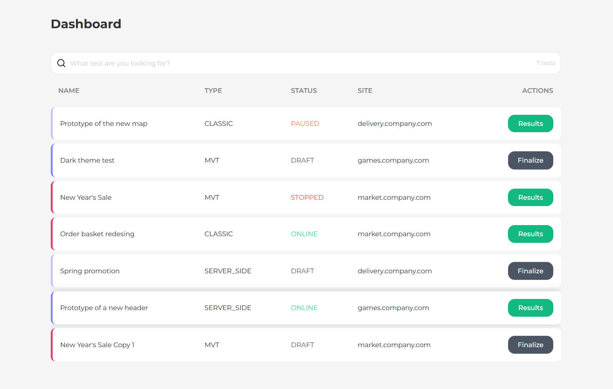

# A/B Tests Dashboard

A modern React application for managing and monitoring A/B tests with a clean, professional interface. Built with React, TypeScript, and Vite.



## 🚀 Features

- **Test Management Dashboard**
  - View all A/B tests in a sortable, filterable table
  - Real-time search functionality
  - Advanced sorting capabilities for test properties
  - Status tracking with visual indicators
- **Test Details**
  - Detailed test results view
  - Test finalization interface
  - Site integration information
- **User Experience**
  - Responsive design
  - Keyboard navigation support
  - Clean and intuitive interface
  - Loading states and error handling

## 🛠 Tech Stack

- **Core:**
  - React 18
  - TypeScript
  - Vite
- **Routing & State:**
  - React Router v6
- **Styling:**
  - SCSS
  - BEM methodology
- **HTTP Client:**
  - Axios
- **UI Components:**
  - Lucide React (icons)
- **Development Tools:**
  - ESLint
  - TypeScript ESLint
  - Sass

## 📦 Installation

1. Clone the repository:

```bash
git clone https://github.com/endjoyer/kameleoon-task.git
```

2. Install dependencies:

```bash
cd kameleoon-task npm install
```

3. Set up and start the API server:
   Clone and run the API server from:
   https://development.kameleoon.net/oivanov/frontend-interview-task-api

## 🔧 Configuration

The application uses Vite for build configuration. Key configuration files:

- `vite.config.ts` - Vite configuration
- `tsconfig.json` - TypeScript configuration
- `.eslintrc.json` - ESLint rules

## 📁 Project Structure

src/  
├── api/ — API integration layer  
├── components/ — Reusable UI components  
├── hooks/ — Custom React hooks  
├── pages/ — Route pages  
├── styles/ — SCSS stylesheets  
├── types/ — TypeScript type definitions  
└── utils/ — Utility functions

## 🎯 Usage

- **Dashboard:** View and manage all A/B tests
- **Search:** Filter tests by name
- **Sorting:** Click column headers to sort
- **Test Details:** Click "Results" to view test data
- **Test Finalization:** Use "Finalize" for draft tests

## 🔑 Key Features Implementation

### Search Functionality

- Real-time filtering
- Case-insensitive search
- Reset capability

### Sorting System

- Multi-column sorting
- Custom sort for status values
- Ascending/Descending toggle

### Routing

- Clean URLs with React Router
- Persistent state between routes
- Back navigation support
